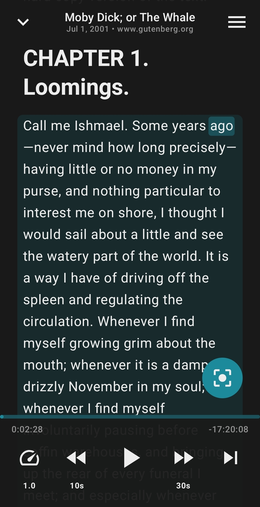
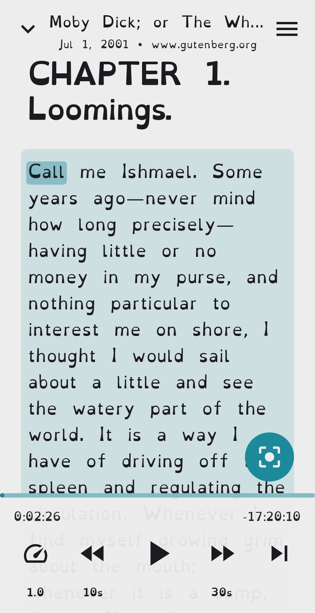

# Narra

|  |  |
|:----------------------------------------------------------------------------------------------------------------------------------------:|:------------------------------------------------------------------------------------------------------------------------------------------------------:|
|                                                           Roboto and dark mode                                                           |                                                              OpenDyslexic3 and light mode                                                              |

Narra is a mobile app (currently Android exclusive) that allows users to listen to webpages and ebooks read aloud by TTS in a podcast-like experience. Choose from a wide variety of TTS voices, subscribe to the RSS feeds of your favourite blogs, and queue up several texts to listen to without ads.

## Disclaimer
This project was vibecoded by someone who didn't start the project with the skills required to write this code by hand. Gemini Flash 3 has been used extensively due to its integration with Android Studio. I understand that I have a lot to learn in order to be a good head dev for this project, and I am sharing this repo with the hope of getting it looked over by more qualified devs than myself. I can't guarantee that data won't be lost when updating (this has happened to me several times while dogfooding), so please keep backups of the content you add to the app. OPML exports are handy for backing up feeds, but the database backup feature probably shouldn't be counted on for backups right now.

## Getting Started

Follow these steps to set up the development environment and build Narra.

### Prerequisites
- Android Studio Ladybug (or newer).
- JDK 17 or higher.

### Setup Instructions

1. **Clone the repository**:
   ```bash
   git clone https://github.com/mienaiKnife/Narra.git
   ```

2. **Open the project**:
   Open Android Studio and select "Open" to choose the project directory.

3. **Gradle Sync**:
   Wait for the project to finish syncing. If there are any issues, go to `File > Sync Project with Gradle Files`.

### Building and Running
- Select the `app` configuration and your target device (emulator or physical device).
- Click the **Run** button or use the shortcut `Shift + F10`.

### Testing
Run unit tests using the following command:
```bash
./gradlew test
```

## Documentation

- [User Guide](docs/USAGE.md) - Learn how to use Narra's features
- [AGENTS.md](AGENTS.md) - Guide to the project for AI agents, which may also be useful for human contributors
- [Localization](LOCALIZATION.md) - Guide to translating Narra into new languages
- [Architecture](docs/ARCHITECTURE.md) - Learn about the project's technical design
- [TTS Engines](docs/TTS_ENGINES.md) - Guide for implementing and extending TTS providers
- [Content Parsing](docs/CONTENT_PARSING.md) - How we extract text from RSS, ebooks, and Web
- [Playback Lifecycle](docs/PLAYBACK_LIFECYCLE.md) - Understanding the media service and audio flow
- [Testing Guide](docs/TESTING_GUIDE.md) - How to run and write tests for Narra
- [Privacy Policy](docs/PRIVACY.md) - Our commitment to your privacy

## Planned Features

- PDF file importing and parsing
- Self-hosted AI TTS server support (e.g. Kokoro, Coqui, Piper via local API)
- Additional cloud AI TTS providers
- Builds for other platforms (e.g. desktop and iOS via Kotlin Multiplatform)
- Optional sync via self-hosted compatible server (e.g. Nextcloud/gpodder-compatible API),
  authenticated by server URL and credentials the user controls — no first-party accounts
- Automatic readability/reader-mode heuristic improvements over time
- Importing texts by scanning photos
- User-customizable color themes
- Support for more languages