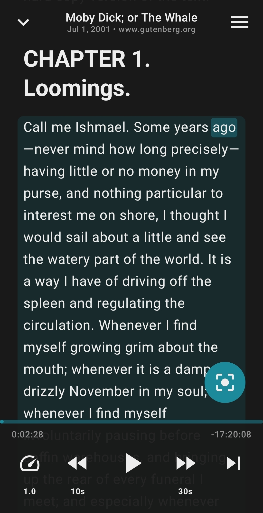
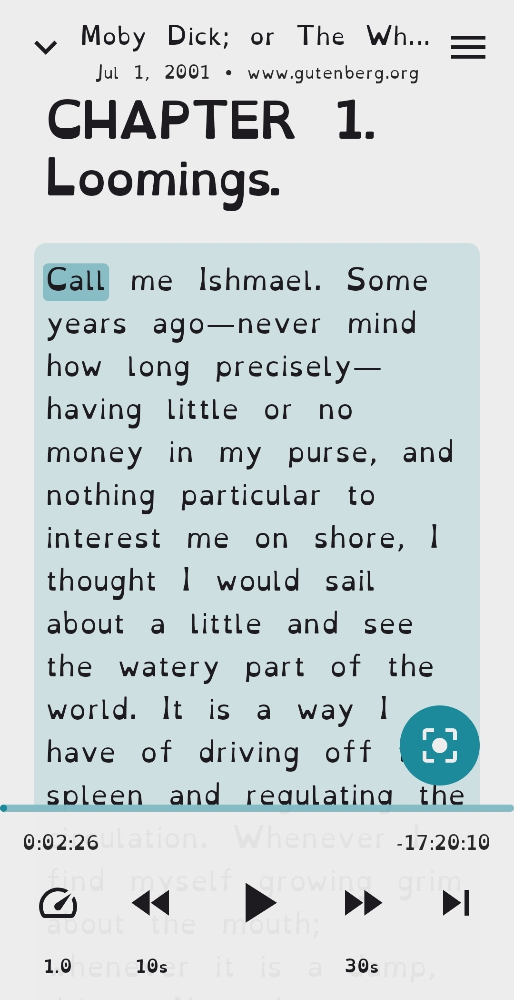

# Narra

|  |  |
|:----------------------------------------------------------------------------------------------------------------------------------------:|:-----------------------------------------------------------------------------------------------------------------------------------------------------------:|
|                                                           Roboto and dark mode                                                           |                                                                OpenDyslexic3 and light mode                                                                 |

Narra is a mobile app (currently Android exclusive) that allows users to listen to webpages and ebooks read aloud by TTS in a podcast-like experience. Choose from a wide variety* of TTS voices, subscribe to the RSS feeds of your favourite blogs, and queue up several texts to listen to without ads.

*At least, that's the goal.

## Disclaimer
This project was vibecoded by someone who didn't start the project with the skills required to write this code by hand. Gemini 3 Flash has been used extensively due to its integration with Android Studio and the generous free tier. I would prefer to fully switch to something like Deepseek V4.1 Flash via OpenCode Go, but I haven't been able to connect it to Android Studio's built-in harness, so I find myself continuing to use Gemini Flash for some tasks even though it's a worse model.

I understand that I have a lot to learn in order to be a good head dev for this project, and I am sharing this repo with the hope of getting it looked over by more qualified devs. 

I can't guarantee that data won't be lost when updating, even though I've done what I can to implement database protection features. If you want to ensure that you keep your listening history and the content that you add to the app, please keep backups. OPML exports are handy for backing up feeds, but the database backup feature could potentially have problems that need fixing.

## Getting Started

Follow these steps to set up the development environment and build Narra.

### Building with Android Studio
Requires Android Studio Quail 4 (2026.1.4) or newer and JDK 21 or higher.

1. **Clone the repository**:
   ```bash
   git clone https://github.com/mienaiKnife/Narra.git
   ```

2. **Open the project**:
   Open Android Studio and select "Open" to choose the project directory.

3. **Gradle Sync**:
   Wait for the project to finish syncing. If there are any issues, go to `File > Sync Project with Gradle Files`.

4. Select the `app` configuration and your target device (emulator or physical device).

5. Click the **Run** button or use the shortcut `Shift + F10`.

### Building without Android Studio

If you just want an APK and would rather not install Android Studio, you can build inside a disposable Docker container instead. The only requirement on your machine is [Docker](https://docs.docker.com/get-docker/) (or Podman).

1. **Build a debug APK**:
   ```bash
   ./build-apk.sh
   ```
   The APK will be written to `out/debug/app-debug.apk`.

2. **Build a release APK**:
   ```bash
   ./build-apk.sh assembleRelease
   ```
   The Docker build produces an unsigned, minified release APK. To build a signed release, see
   [docs/RELEASING.md](docs/RELEASING.md).

3. **Install on a device**:
   ```bash
   adb install out/debug/app-debug.apk
   ```

The first run downloads the Android SDK and project dependencies, so it takes a few minutes. Subsequent builds reuse cached layers and Gradle dependencies, so they are usually under a minute. See `Dockerfile` for details.

### Testing
Run unit tests using the following command:
```bash
./gradlew test
```

## Documentation

- [User Guide](docs/USAGE.md) - Learn how to use Narra's features
- [AGENTS.md](AGENTS.md) - Guide to the project for AI agents, which may also be useful for human contributors
- [Localization](LOCALIZATION.md) - Guide to translating Narra into new languages
- [Architecture](docs/ARCHITECTURE.md) - Learn about the project's technical design
- [TTS Engines](docs/TTS_ENGINES.md) - Guide for implementing and extending TTS providers
- [Content Parsing](docs/CONTENT_PARSING.md) - How we extract text from RSS, ebooks, and Web
- [Playback Lifecycle](docs/PLAYBACK_LIFECYCLE.md) - Understanding the media service and audio flow
- [Testing Guide](docs/TESTING_GUIDE.md) - How to run and write tests for Narra
- [Releasing](docs/RELEASING.md) - Signing, versioning, and publishing releases
- [Contributing](docs/CONTRIBUTING.md) - How to contribute, coding standards, and tests
- [Roadmap](ROADMAP.md) - Where the project is headed
- [Privacy Policy](docs/PRIVACY.md) - Our commitment to your privacy
- [Security Policy](SECURITY.md) - How to report a vulnerability

## Current Features

- **RSS Feed Subscription**: Subscribe to blog feeds and automatically fetch new articles.
- **Web Page Importing**: Extract clean text from webpages using a reader-mode heuristic for a distraction-free experience.
- **EPUB Support**: Import and listen to DRM-free ebook files in EPUB format.
- **Listening Queue**: A playlist-style UI for managing and listening to multiple articles in sequence.
- **Multiple TTS Engines**: Support for Android's built-in TTS and natural-sounding, on-device AI voices (Sherpa-ONNX).
- **Background Playback**: Foreground service support for uninterrupted listening with system media controls and lock screen integration.
- **Home Screen Widget**: Glance-based widget for quick playback control and queue status.
- **Database Backup & Sync**: File-based backup/restore and optional auto-export for manual syncing (e.g., via Syncthing).
- **OPML Support**: Import and export your feed list for easy migration between RSS apps.
- **Privacy First**: No accounts required; all data and TTS synthesis stay on your device.

## Planned Features

See [ROADMAP.md](ROADMAP.md) for planned features and non-goals.